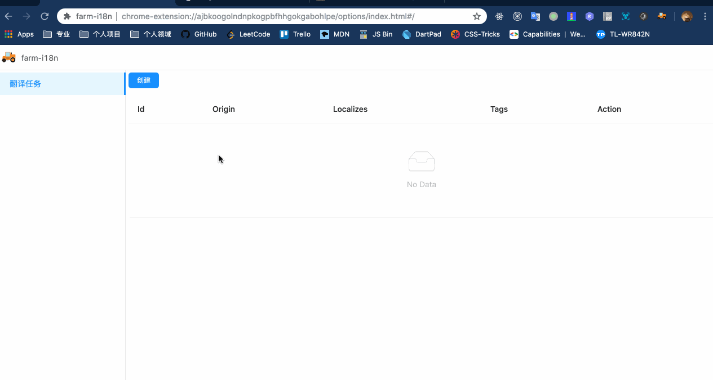

# farm-platfrom

  

i18n 国际化运营支持平台

## 支持

- [farm-translation](./packages/farm-translation) 命令行工具
- [webpack-extract-i18n-plugin](./packages/webpack-extract-i18n-plugin) Webpack 插件
- [farm-i18n](./extension/farm-i18n) 管理 i18n 国际化配置文件的 Extension

## 如何使用

请先下载 [Chrome Extension Releases 1.0.0](https://github.com/icepy/farm-platfrom/releases/tag/1.0.0)  使用 `farm-i18n` 来管理你的 i18n 配置文件。



格式如下：

```json
{
  "appName": {
    "zh_CN": {"message": "farm-i18n"}
  },
  "OPTIONS_MENU_I18N_LIST": {
    "zh_CN": {"message": "翻译任务"}
  },
  "OPTIONS_CREATE_I18N_TASK": {
    "zh_CN": {"message": "创建翻译任务"}
  },
  "OPTIONS_CREATE_TEXT": {
    "zh_CN": {"message": "创建"}
  }
}
```

你可以使用扩展来输出不同语言的翻译格式，开发者可以将这份文件保存到本地。

使用 Webpack 构建打包的用户可以使用 [webpack-extract-i18n-plugin](./packages/webpack-extract-i18n-plugin) 来做提取自动生存 i18n 真正需要依赖的文件和目录。
